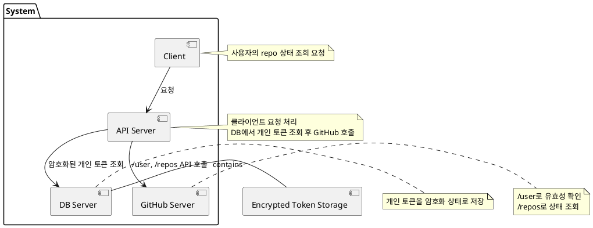
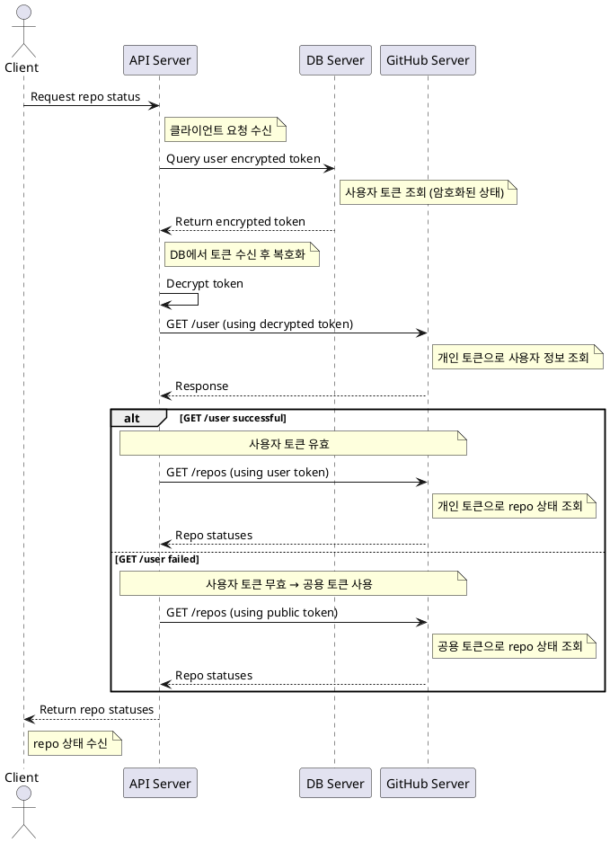

# 📌 PlantUML 설계 문서

본 문서는 **클라이언트-API-DB-GitHub** 간의 repo 상태 조회 구조를 설명하고,  
PlantUML 코드에 설명을 포함하여 설계 및 리뷰 시 참고할 수 있도록 작성되었습니다.

---

## 🌱 🔷 컴포넌트 다이어그램 with 설명

---

## 🌱 🔷 시퀀스 다이어그램 with 설명

---

## 📝 🔷 요약

- **컴포넌트 다이어그램** : 시스템 구성 및 의존 관계 표현  
- **시퀀스 다이어그램** : 클라이언트 → API → DB → GitHub 전체 플로우 설명  
- **주석(`'`)** : 코드 내 설명용  
- **note** : 다이어그램 렌더링 시 표시

---

### ✅ 추가 요청 가능

- OAuth 인증 흐름
- 토큰 암복호화 처리 상세
- DB 암호화 키 관리 구조
- API 시나리오별 Activity Diagram

필요 시 말씀해 주세요.